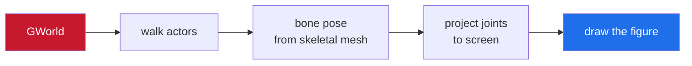
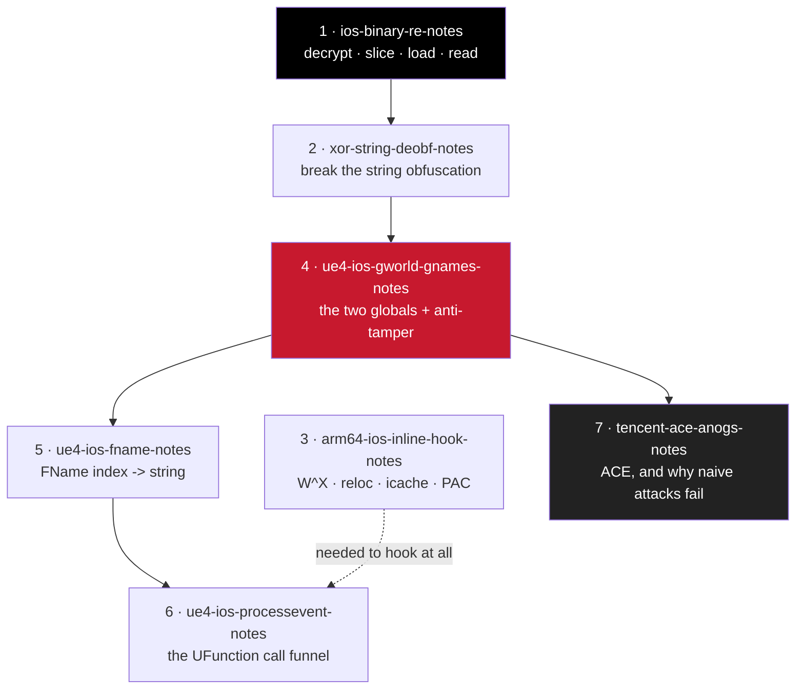
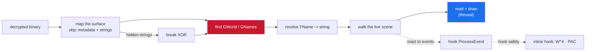

<h1 align="center">ios-ue4-re</h1>

reverse engineering and building read-only overlays for Unreal Engine 4 games on iOS (arm64 / arm64e)

  
  
  
  

---

Notes and a working example for reverse engineering and building overlays for
Unreal Engine 4 games on iOS. This is the stuff I kept re-explaining to people,
collected in one place, plus a small tweak that puts all of it together so you can
see it actually run instead of just reading about it.

> **Read-only, analysis-and-visualization oriented.** No memory writes into the
> game, no netcode tampering. If you want to learn how a UE4 iOS overlay is put
> together, start here.

---

## the example

[**Reveal**](https://github.com/shiedless/Reveal) is a ~500-line skeleton ESP. It
reads `GWorld`, walks the actors, pulls each character's bone pose straight out of
the skeletal mesh, projects the joints to screen and draws a figure. That is the
whole thing — deliberately tiny so the data path is legible end to end, and the
concrete version of every note below.

---

## the notes

Read them in this order if you're new — each one leans on the last.

| # | note | what it covers |
|---|------|----------------|
| 1 | [**ios-binary-re-notes**](https://github.com/shiedless/ios-binary-re-notes) | getting a decrypted binary, picking the right slice, loading it, and reading an iOS app at all — the groundwork |
| 2 | [**xor-string-deobf-notes**](https://github.com/shiedless/xor-string-deobf-notes) | breaking the XOR string obfuscation you hit the moment the app hides anything |
| 3 | [**arm64-ios-inline-hook-notes**](https://github.com/shiedless/arm64-ios-inline-hook-notes) | inline hooks by hand — W^X, instruction relocation, the icache, PAC — the four things that crash you |
| 4 | [**ue4-ios-gworld-gnames-notes**](https://github.com/shiedless/ue4-ios-gworld-gnames-notes) | finding the two globals everything hangs off, and the anti-tamper traps around them |
| 5 | [**ue4-ios-fname-notes**](https://github.com/shiedless/ue4-ios-fname-notes) | turning an FName index into a string, which you need to match anything by name |
| 6 | [**ue4-ios-processevent-notes**](https://github.com/shiedless/ue4-ios-processevent-notes) | finding `ProcessEvent`, the funnel every UFunction call goes through |
| 7 | [**tencent-ace-anogs-notes**](https://github.com/shiedless/tencent-ace-anogs-notes) | how Tencent's ACE anti-cheat is built and why the naive attacks on it fail — analysis, not a bypass |

---

## what you need

| | |
|---|---|
| **device** | a jailbroken iOS device (or a solid emulator/sim setup) to run and dump on |
| **build** | [Theos](https://theos.dev) for building tweaks |
| **static** | IDA, Ghidra or Binary Ninja |
| **background** | a rough grip on ARM64 assembly and C/C++ |

> None of the notes assume Windows-only tooling, which most UE RE guides quietly do.

---

## how the pieces fit

The short version of the whole workflow:

Get a decrypted binary (`ios-binary-re-notes`). Load it, skim the Objective-C
metadata and strings to map the surface. If the app hides its strings, break the XOR
(`xor-string-deobf-notes`). Find `GNames` and `GWorld`
(`ue4-ios-gworld-gnames-notes`), then you can resolve names (`ue4-ios-fname-notes`)
and walk the live scene. From there an overlay is just reading the world and drawing
it — which is what Reveal does. If you need to react to game events instead of just
reading state, hook `ProcessEvent` (`ue4-ios-processevent-notes`), and if you need to
hook code at all, do it without crashing (`arm64-ios-inline-hook-notes`). If the game
has ACE, know what you're walking into (`tencent-ace-anogs-notes`).

---

## a note on intent

This is for learning how these systems work and building read-only tools on top of
them. The anti-cheat writeup in particular stops at understanding on purpose. Do what
you want with the knowledge, but the repos themselves don't ship attacks.

---

## beyond ue4

Same approach, other engines and tools:

| repo | what it covers |
|------|----------------|
| [**unity-il2cpp-esp-tutorial**](https://github.com/shiedless/unity-il2cpp-esp-tutorial) | the unity il2cpp side — a native objc overlay from `dump.cs` to screen, plain uikit |
| [**roblox-ios-luau-vm-notes**](https://github.com/shiedless/roblox-ios-luau-vm-notes) | reversing roblox's luau runtime on iOS: functions, anchors, `lua_State` layout |
| [**ios-messiah-re**](https://github.com/shiedless/ios-messiah-re) | netease's messiah engine: an ecs with no `GWorld`, a python gameplay layer, telemetry anti-cheat |
| [**ida-pro-guide**](https://github.com/shiedless/ida-pro-guide) | getting around a binary in IDA — useful for every note above |

---

## questions and corrections

- **questions, ideas, "how did you find X"** → [Discussions](https://github.com/shiedless/ios-ue4-re/discussions)
- **something in a note is wrong or outdated** → [open a correction](https://github.com/shiedless/ios-ue4-re/issues/new?template=correction.yml) — there's a dropdown for which note

If the notes saved you time, a ⭐ on the repo helps other people find them.

---

## license

MIT across the board.

---

— shiedless

